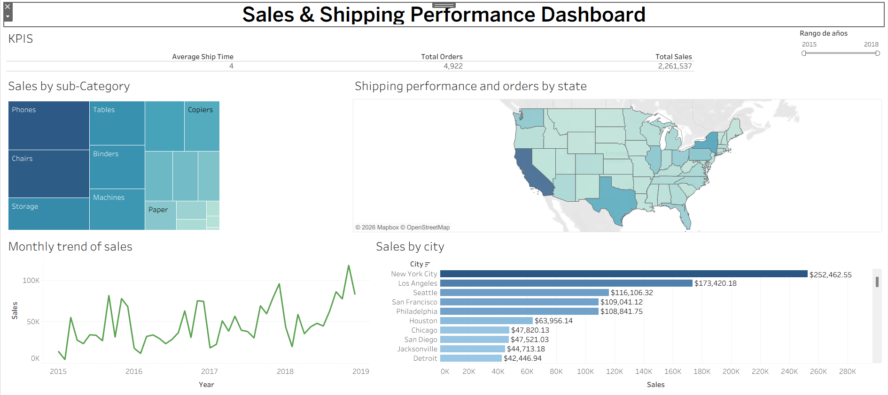

# tableau-sales-shipping-dashboard
Tableau portfolio project: sales and shipping analysis

## Dataset

The dataset used in this project was obtained from Kaggle public datasets.

## Dashboard

## Overview

This project analyzes sales and shipping performance using Tableau.
The dashboard provides an interactive view of sales trends, product.
performance, geographical distribution, and shipping times.

## Objectives

- Analyze sales trends over time.
- Identify the best-performing product sub-categories.
- Compare sales performance across cities and states.
- Analyze average shipping time by state.
- Provide an interactive dashboard for business analysis.

## Tools

- Tableau
- Data Visualization
- Calculated Fields
- Filters
- Dashboard Actions

## Key Insights

- Phones generated the highest sales among sub-categories.
- New York City was the highest-selling city.
- Sales showed an overall increasing trend toward the end of the period.
- Shipping performance varies between states.
